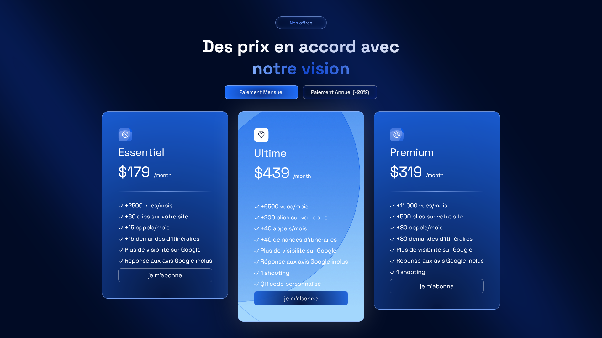

# modern-pricing-landing-page-vuejs




# Spikes Design Challenge: Pricing Cards 🎨💡

Bienvenue dans le challenge Spikes de la semaine ! 🎉 Cette fois, je booste mon design avec un challenge de *pricing* ultra moderne, en mettant l'accent sur une présentation claire et élégante des offres. 

## Le défi : 

je devais créer une page avec **3 cartes de tarification** distinctes, chacune représentant une offre différente. Chaque carte devait être conçue de manière à attirer l'attention de l'utilisateur et à rendre la navigation facile et agréable. L'idée ici est de démontrer mes compétences en design tout en jouant avec la hiérarchie des informations.

## Ce que je devais inclure :
- **3 cartes de tarification** avec des descriptions claires des offres
- Un design propre, moderne, et **responsive** (surtout les mobiles !)
- Des éléments interactifs comme des boutons d'appel à l'action (ex : "S"abonner")
- Une hiérarchie de contenu qui rend l'offre la plus chère plus attrayante tout en mettant en avant les autres options
- Des couleurs et typographies qui donnent du caractère au design

## Objectif :
Améliorer mon design en utilisant les meilleures pratiques du web design et en appliquant des techniques modernes. J'ai pu intégrer des animations légères ou des transitions pour donner un aspect interactif à mes cartes de pricing.

Et vous, vous êtes prêt à relever ce challenge ? 💪🚀


<br><br><br><br><br><br><br><br>


# modern-pricing-landing-page-vuejs


# Spikes Design Challenge: Pricing Cards 🎨💡

Welcome to this week's Spikes challenge! 🎉 This time, I'm taking my design skills to the next level with a super modern *pricing* challenge, focusing on clear and sleek presentation of offers.

## The challenge: 

I had to create a page with **3 distinct pricing cards**, each representing a different offer. Each card had to be designed to grab the user's attention while keeping the navigation easy and pleasant. The idea here is to showcase my design skills by playing with information hierarchy.

## What I had to include:
- **3 pricing cards** with clear descriptions of the offers
- A clean, modern, and **responsive design** (especially for mobile!)
- Interactive elements like call-to-action buttons (e.g., "Subscribe")
- A content hierarchy that makes the most expensive offer stand out while highlighting the other options
- Colors and typography that give character to the design

## Goal:
The goal was to improve my design by using the best web design practices and applying modern techniques. I also integrated light animations or transitions to give an interactive feel to my pricing cards.

What about you? Are you ready to take on this challenge? 💪🚀


## Project setup
```
npm install
```

### Compiles and hot-reloads for development
```
npm run serve
```

### Compiles and minifies for production
```
npm run build
```

### Lints and fixes files
```
npm run lint
```

### Customize configuration
See [Configuration Reference](https://cli.vuejs.org/config/).
